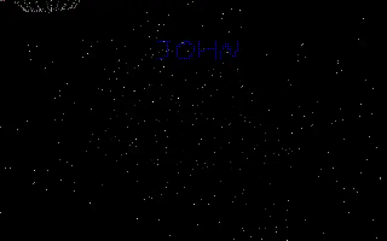

# 4ReAL / Turbo Pascal + ASM Demo

A small DOS demo project from school days, originally written on 29 May 1998 to learn x86 assembly while already being comfortable with Turbo Pascal.

This repo contains [code/4rl2026.pas](code/4rl2026.pas), a bug-fixed (2026) copy of the original demo source.

I wrote this as my second demo ever. It is rough, direct, and very much in the style of late-90s Mode 13h experiments.

## Copyright and License

Copyright (c) 1998-2026 4ReAL.

This project is licensed under the GNU Affero General Public License v3.0 (AGPL-3.0).

AGPL requires preserving copyright/license notices and making source code available for distributed/modified versions (including software provided over a network).

Full terms: [LICENSE](LICENSE)

Author request (not an additional legal term):

- Please credit Christo Greeff in substantial reuse.
- Please clearly note what you changed.
- Please inform me of public usage or major changes by opening an issue in this repository.

## Videos

Demo first:

- [video/demo.github.mp4](video/demo.github.mp4)
- [video/compile.github.mp4](video/compile.github.mp4)
- Preview: [video/demo.preview.webp](video/demo.preview.webp)

If inline playback does not appear in your GitHub view, open the files directly:

- [Demo video](video/demo.github.mp4)
- [Compile video](video/compile.github.mp4)

## What The Demo Does (from source)

Based on [code/4rl2026.pas](code/4rl2026.pas), the program runs several old-school software-rendered effects in VGA 320x200x256:

- Enters Mode 13h and writes directly to video memory ($A000).
- Uses custom assembler routines for line drawing, pixel access, clears, and page flipping.
- Uses vertical retrace sync and palette programming for smooth transitions and fades.
- Loads a custom binary font from 4real.fnt and renders zoomed text using an 8x8 bitmap per character.
- Shows a flashing title sequence.
- Generates a plasma effect.
- Renders a starfield plus a rotating/projected 3D point set loaded from OBJ.3D.
- Loads and displays an indexed image from GOLF.4RI (VW Golf), then applies sine-based distortion and motion effects.
- Runs a classic text-over-fire style effect.

## Asset Notes

### Custom Font

I wrote a FONTMAKE.PAS tool to build my own fonts using mouse input and Turbo Pascal BGI graphics.

That tool is not included in this repo right now, but the generated font is loaded by the demo as 4real.fnt.

From the available source, the font data layout is a Turbo Pascal typed-record style binary structure for ASCII 43..90, with 64 bytes (8x8) per character.

### GOLF.4RI

I do not currently remember the original conversion pipeline used in 1998.

From [code/4rl2026.pas](code/4rl2026.pas), the file appears to be read as a raw typed record containing:

- Indexed pixel data: 260x160 bytes
- Palette: 256 entries x RGB (3 bytes)

### OBJ.3D

I do not currently remember the exact export/conversion steps either.

I might have used 3ds Max 2.5 at the time.

From [code/4rl2026.pas](code/4rl2026.pas), OBJ.3D appears to be read as a raw typed record of 530 points x 3 coordinates (Real), used as a point cloud for rotation/projection.

## Source Credits

Original demo and tooling by 4ReAL (1998), with this repository preserving the work and a 2026 bug-fixed source copy.
